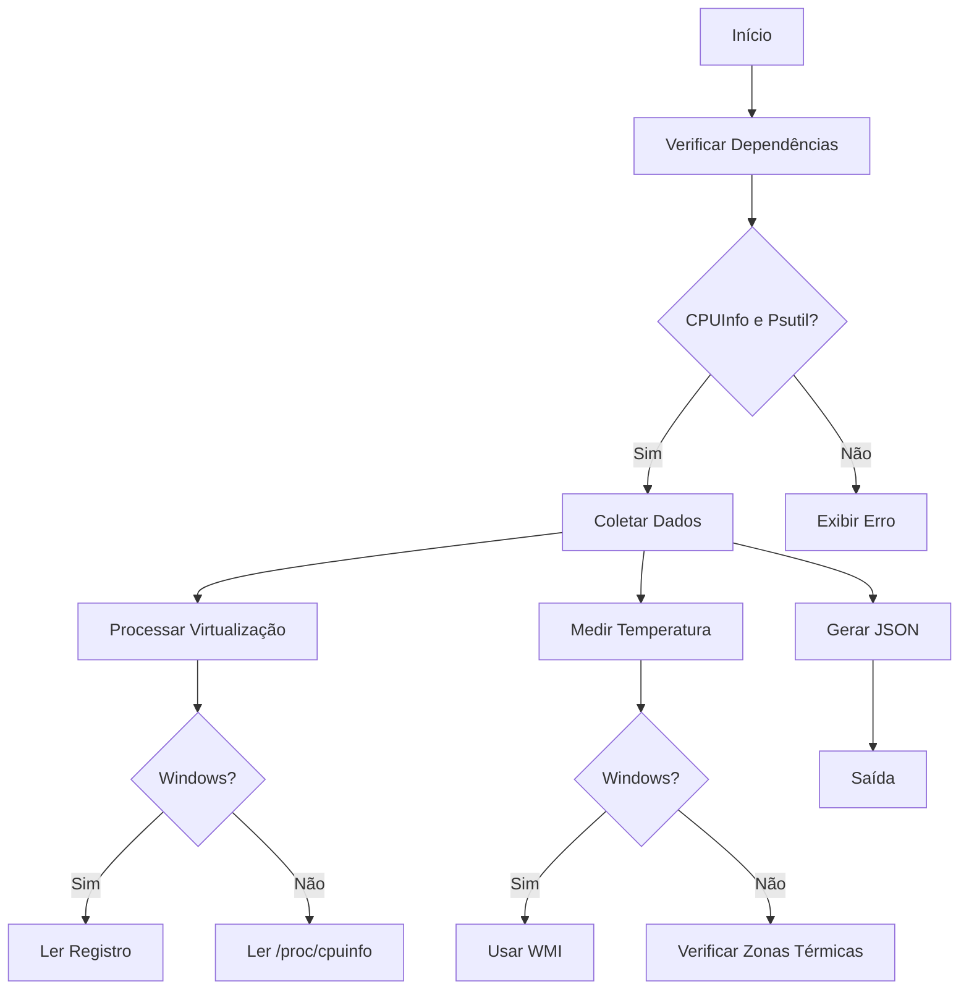

# Módulo de Análise Avançada de Processador


## Visão Geral do Projeto
Módulo Python para coleta abrangente de dados técnicos de processadores, fornecendo insights detalhados sobre capacidades de hardware, desempenho em tempo real e características arquiteturais. Desenvolvido para integração em sistemas de monitoramento, ferramentas de diagnóstico e aplicações de gestão de infraestrutura.

**Características Principais**:
- Análise completa de instruções suportadas (SSE/AVX)
- Detecção de tecnologias de virtualização
- Topologia detalhada de núcleos e cache
- Métricas de desempenho em tempo real
- Compatibilidade multiplataforma
- Saída estruturada em JSON

## Estrutura da Saída JSON
- Lembrando que essa saida são de informações do meu computador
### 1. Metadados (`metadata`)
```json
"metadata": {
  "timestamp": "2025-02-13T14:42:34.249749",
  "platform": "Windows-11-10.0.22621-SP0",
  "python_version": "3.13.0",
  "script_version": "2.0.1"
}
```
| Campo | Descrição | Tipo | Exemplo |
|-------|-----------|------|---------|
| timestamp | Data/hora da coleta (ISO 8601) | string | "2025-02-13T14:42:34.249749" |
| platform | Sistema operacional e versão | string | "Windows-11-10.0.22621-SP0" |
| python_version | Versão do interpretador Python | string | "3.13.0" |
| script_version | Versão do módulo de coleta | string | "2.0.1" |

### 2. Identificação do Processador (`identification`)
```json
"identification": {
  "vendor": "GenuineIntel",
  "brand": "Intel(R) Core(TM) i3-4130 CPU @ 3.40GHz",
  "is_intel": true,
  "is_amd": false
}
```
| Campo | Descrição | Tipo | Valores Possíveis |
|-------|-----------|------|-------------------|
| vendor | Fabricante do processador | string | "GenuineIntel", "AuthenticAMD" |
| brand | Modelo comercial completo | string | Nome completo do processador |
| is_intel | Identificação Intel® | boolean | true/false |
| is_amd | Identificação AMD® | boolean | true/false |

### 3. Arquitetura (`architecture`)
```json
"architecture": {
  "bits": 64,
  "arch": "AMD64",
  "family": 6,
  "model": 60,
  "stepping": 3
}
```
| Campo | Descrição | Tipo | Significado Técnico |
|-------|-----------|------|---------------------|
| bits | Arquitetura de bits | integer | 32/64 |
| arch | Família arquitetural | string | x86_64, ARM, etc |
| family | Família do processador | integer | Intel Core Family |
| model | Modelo específico | integer | Identificador de geração |
| stepping | Revisão do chip | integer | Versão do stepping |

### 4. Topologia de Núcleos (`cores`)
```json
"cores": {
  "physical": 2,
  "logical": 4,
  "hyperthreading": true
}
```
| Campo | Descrição | Método de Coleta |
|-------|-----------|-------------------|
| physical | Núcleos físicos | `psutil.cpu_count(logical=False)` |
| logical | Núcleos lógicos | `psutil.cpu_count()` |
| hyperthreading | Tecnologia HT/SMT | Comparação logical/physical |

### 5. Hierarquia de Cache (`cache`)
```json
"cache": {
  "l1": {
    "instruction": "N/A",
    "data": "N/A"
  },
  "l2": 524288,
  "l3": 3145728,
  "associativity": {
    "l1": "N/A",
    "l2": 6
  }
}
```
| Nível | Descrição | Unidade |
|-------|-----------|---------|
| L1 | Cache de instruções/dados | KB |
| L2 | Cache secundário | bytes |
| L3 | Cache compartilhado | bytes |
| Associatividade | Estratégia de mapeamento | Way |

### 6. Virtualização (`virtualization`)
```json
"virtualization": {
  "supported": false,
  "type": "N/A",
  "enabled": null
}
```
| Campo | Detecção | Técnica |
|-------|----------|---------|
| supported | Flags CPUID | VMX/SVM |
| type | Tecnologia específica | Intel VT-x/AMD-V |
| enabled | Status no BIOS | Registry/ProcFS |

### 7. Extensões de Instruções (`extensions`)
```json
"extensions": {
  "sse": true,
  "avx2": true,
  ...
}
```
Conjunto completo de 20+ tecnologias monitoradas:
- **SSE/AVX**: Instruções vetoriais
- **AES**: Aceleração criptográfica
- **TSX**: Transações em hardware
- **SHA**: Extensões de segurança

### 8. Métricas de Desempenho (`performance`)
```json
"performance": {
  "frequency": {
    "current": 3400.0,
    "max": "3.4000 GHz"
  },
  "temperature": null
}
```
| Métrica | Fonte | Precisão |
|---------|-------|----------|
| Frequência | `psutil` | ±1% |
| Utilização | Per-core | 100ms sampling |
| Temperatura | WMI/SysFS | Hardware-dependente |

## Bibliotecas Utilizadas

| Biblioteca | Versão | Propósito | Documentação |
|------------|--------|-----------|---------------|
| `cpuinfo` | 9.0.0 | Extração detalhada de dados do processador | [PyPI](https://pypi.org/project/py-cpuinfo/) |
| `psutil` | 5.9.5 | Métricas de desempenho em tempo real | [psutil](https://psutil.readthedocs.io/) |
| `platform` | Built-in | Detecção de plataforma e arquitetura | [Python Docs](https://docs.python.org/3/library/platform.html) |
| `wmi` (Windows) | 1.5.1 | Leitura de temperatura via WMI | [wmi](https://pypi.org/project/WMI/) |

## Requisitos do Sistema

1. **Python**: 3.7+
2. **Sistemas Operacionais**:
   - Windows 10/11 (x64)
   - Linux (Kernel 4.4+)
   - macOS 10.15+
3. **Privilégios**:
   - Leitura de registro (Windows)
   - Acesso a /proc e /sys (Linux)

## Instalação e Uso

```bash
# Instalação de dependências
pip install py-cpuinfo psutil

# Opcional para Windows
pip install wmi

# Execução
python processor_analyzer.py > output.json
```

## Cenários de Aplicação

1. **Benchmarking Automatizado**:
   - Comparação de configurações de hardware
   - Verificação de requisitos de software

2. **Monitoramento de Infraestrutura**:
   - Detecção de gargalos de desempenho
   - Análise de utilização de recursos

3. **Validação de Virtualização**:
   - Verificação de compatibilidade com hypervisors
   - Auditoria de segurança de ambientes virtualizados

4. **Otimização de Cargas de Trabalho**:
   - Ajuste de parâmetros por arquitetura
   - Alocação inteligente de recursos

## Limitações Conhecidas

1. **Temperatura**:
   - Requer drivers específicos no Windows
   - Não suportado em todas as placas-mãe

2. **Virtualização**:
   - Detecção no BIOS depende de acesso privilegiado

3. **Cache L1**:
   - Depende de implementação do fabricante

## Considerações de Desenvolvimento

1. **Padrões de Codificação**:
   - PEP-8 com type hints
   - Docstrings compatíveis com Google Style

2. **Tratamento de Erros**:
   - Fallback para 'N/A' em dados indisponíveis
   - Logging multi-nível (DEBUG a CRITICAL)

3. **Extensibilidade**:
   - Design modular para novas funcionalidades
   - Interface clara para integração com APIs

4. **Performance**:
   - Coleta assíncrona de métricas
   - Cache de dados estáticos

# ATUALIZAÇÃO (2.1.0)

## Module for Advanced Analysis of Processors and Computing (MAAPC)


## Visão Geral do Projeto

**Novas Funcionalidades**:
- Sistema de logging unificado com timestamp
- Verificação de dependências em tempo de execução
- Coleta resiliente de dados sensíveis
- Suporte a múltiplos sensores de temperatura (Linux)

## Estrutura da Saída JSON (Exemplo Real)

```json
{
  "metadata": {
    "timestamp": "2025-02-13T17:42:05.737812",
    "platform": "Windows-11-10.0.22621-SP0",
    "python_version": "3.13.0",
    "script_version": "2.1.0"
  },
  "identification": {
    "vendor": "GenuineIntel",
    "brand": "Intel(R) Core(TM) i3-4130 CPU @ 3.40GHz",
    "is_intel": true,
    "is_amd": false
  },
  "virtualization": {
    "supported": false,
    "type": "N/A",
    "enabled": null
  },
  "performance": {
    "temperature": null
  }
}
```

### Principais Atualizações na Estrutura:
1. **Virtualização Aprimorada**:
   - Campo `enabled` pode retornar `null` para casos de:
     - Chave de registro ausente no Windows
     - Acesso negado ao `/proc/cpuinfo` no Linux
     - Hardware não compatível

2. **Dados de Temperatura**:
   - Retorno `null` quando:
     - Módulo `wmi` não instalado (Windows)
     - Sensores não detectados (Linux)
     - Erro de permissão

3. **Metadados Expandidos**:
   - Versão do script semântica (`2.1.0`)
   - Timestamp com precisão de microssegundos

## Fluxo de Trabalho Aprimorado



## Atualizações nas Bibliotecas

| Biblioteca | Versão | Papel Atualizado | Notas de Uso |
|------------|--------|-------------------|--------------|
| `wmi` | 1.5.1 | Opcional para Windows | Requer instalação manual |
| `psutil` | 5.9.5 | Coleta de Load Average | Suporte multiplataforma |
| `cpuinfo` | 9.0.0 | Detecção de Cache L3 | Depende do fabricante |

## Guia de Instalação Atualizado

```bash
# Instalação básica (todas as plataformas)
pip install py-cpuinfo psutil

# Funcionalidades completas para Windows
pip install wmi

# Permissões para Linux (opcional)
sudo chmod -R a+r /sys/class/thermal/
```

## Cenários de Erro Tratados

1. **Virtualização não detectável**:
```python
except FileNotFoundError:
    self._logger.warning("Chave de registro de virtualização não encontrada")
    return None
```

2. **Dependência ausente**:
```python
except ImportError as e:
    print(f"Erro: Dependência não instalada - {e.name}")
```

3. **Sensor de temperatura inacessível**:
```python
except PermissionError:
    self._logger.error("Acesso negado ao sensor térmico")
```

## Política de Versionamento

| Versão | Mudanças Críticas | Compatibilidade |
|--------|-------------------|-----------------|
| 2.1.0 | Tratamento de exceções específicas | Python 3.7+ |
| 2.0.1 | Primeira versão estável | Windows/Linux |
| 1.x | Versões experimentais | Descontinuada |

## Dashboard de Monitoramento (Benchmark)

| Métrica                   | Valor                |
|---------------------------|----------------------|
| Tempo de Execução (ms)    | 1857.93              |
| Uso de Memória (MB)       | -0.98                |
| Uso de CPU (%)           | 11.86                |
| Uso de GPU (%)           | N/A                  |
| Temperatura da GPU (°C)   | N/A                  |
| Uso de Memória da GPU (MB)| N/A                  |
| Memória do Processo (MB)  | 54.66                |


## Roadmap de Desenvolvimento

- [x] Suporte a múltiplas zonas térmicas
- [x] Verificação de dependências em runtime
- [ ] Integração com Prometheus
- [ ] Coleta de dados de GPU
- [ ] Suporte a ARM64

## Licença e Contribuição

```text
MIT License - Livre para uso comercial e modificações
Relate issues em: github.com/panda12332145/MAAPC
```


# created by - Panda12332145 

  

## 🧑‍💻 Sobre Mim  
Sou um apaixonado por **Física Teórica, Cibersegurança e Desenvolvimento de Sistemas**. Busco constantemente **conhecimento profundo** em áreas como hacking, programação de baixo nível e computação avançada. Tenho interesse em **engenharia reversa, criptografia e segurança da informação**, além de um grande apreço por música, filosofia e linguagens.  

## 🌐 Conecte-se Comigo  
- **🔗 Site:** [meusite.com](https://panda-h0me.netlify.app/)  
- **📺 YouTube:** [youtube.com/@X86BinaryGhost](https://www.youtube.com/@X86BinaryGhost)  
- **📸 Instagram:** [@01pandal10](https://www.instagram.com/01pandal10/)  
- **🖥 GitHub:** [github.com/panda12332145](https://github.com/panda12332145)  

## 🚀 Áreas de Interesse  
- **Cibersegurança Avançada** 🔒  
- **Hacking & Engenharia Reversa** 💻  
- **Computação de Baixo Nível** 🖥️  
- **Matemática e Física Teórica** 📐⚛️  
- **Música e Filosofia** 🎵📖  

_"Conhecimento é poder, e a verdadeira liberdade vem do domínio sobre a informação."_  

---

📩 Para colaborações e projetos, sinta-se à vontade para me contatar! [📧Enviar e-mail para Panda12332145](mailto:amandasyscallinjector@gmail.com?subject=Interesse%20no%20projeto%20MAAPC&body=Olá%20Panda12332145,%0D%0A%0D%0AEspero%20que%20este%20e-mail%20lhe%20encontre%20bem.%20tive%20a%20oportunidade%20de%20conhecer%20seu%20projeto%20MAAPC%20no%20GitHub.%0D%0A%0D%0AFiquei%20muito%20interessado%20na%20abordagem%20e%20nas%20funcionalidades%20do%20projeto%20e%20gostaria%20de%20conversar%20mais%20sobre%20ele.%20Se%20possível,%20poderia%20compartilhar%20mais%20detalhes%20ou%20até%20mesmo%20discutirmos%20sobre%20possíveis%20colaborações?%0D%0A%0D%0AAgradeço%20desde%20já%20pela%20atenção%20e%20aguardo%20seu%20retorno.)
